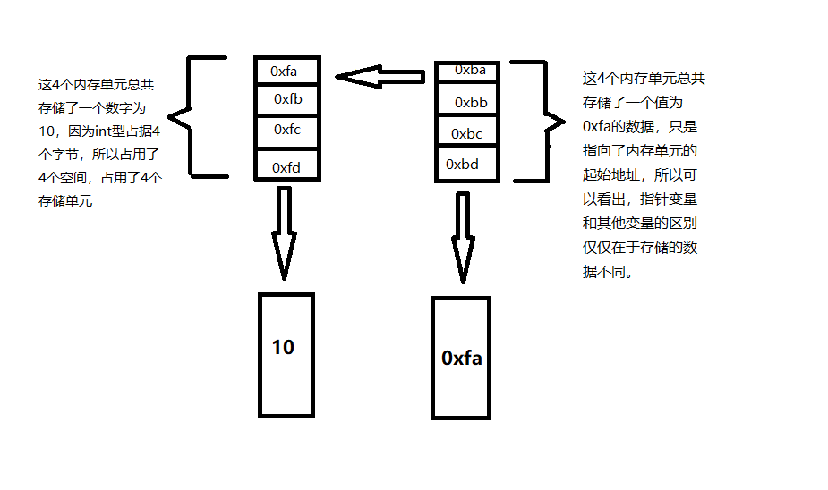

# C语言

## 概述
在C语言中，内存单元的地址成为指针，专门用来存放地址的变量，成为指针变量。
C语言程序设计中使用指针可以：
1. 使程序简洁、紧凑、高效
2. 有效的表示复杂的数据结构
3. 动态分配内存
4. 得到多余一个的函数返回值


## 指针的初始化
初始化即为赋初值。
一般形式为：
<存储类型> <数据类型> * <指针变量名> = <地址量>；
e.g.
``` c
int a,*p = &a; //将变量a的地址作为初值赋予了int型指针p
```

或者

``` c
int a;
int *p = &a;
```

或者

```
int a;
int *p;
p = &a;
```

## 实质
指针即是地址，变量定义后即需要内存空间，而内存空间则为其分配好后，内存单元的编号即是地址也就是指针。指针指向变量，指针的值是变量的起始地址。也就是说指针中存放的就是该变量的地址，该地址就是一个内存单元的编号，为一个16进制数字。  而变量中存在的则是提前定义好的数值。下面举例：
e.g.
``` c
short a=10; // short占2个字节(16bit)
int b=20;   // int占4个字节(32bit)
float c=20.00; // float占4个字节(32bit)
char d='A';  // char占1个字节(8bit)
int *p;
p = &b;    //指针变量p指向了整型变量b
```
如图：


## 指针的运算

1. 指针运算是以指针变量所存放的地址量作为运算量而进行的运算。
2. 指针运算的实质就是地址的计算
3. 指针运算的种类是有限的，它只能进行赋值运算，算术运算和关系运算。

## 指针关系运算
1. 两指针之间的关系运算表示它们指向的地址位置之间的关系。指向地址打的指针大于指向地址小的指针。
2. 指针与一般整数变量之间的关系运算没有意义。但可以和零进行等于或不等于的关系运算，判断指针是否为空。

