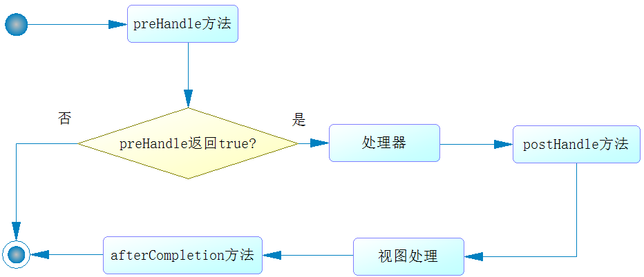

# 拦截器


首先所有的拦截器都需要实现HandlerInterceptor接口.
接口定义如下：
``` java 
package org.springframework.web.servlet;

/**** imports ****/
public interface HandlerInterceptor {

    // 处理器执行前方法
    default boolean preHandle(HttpServletRequest request, HttpServletResponse response, 
        Object handler) throws Exception {
        return true;
    }

    // 处理器处理后方法
    default void postHandle(HttpServletRequest request, 
            HttpServletResponse response, Object handler,
            @Nullable ModelAndView modelAndView) throws Exception {
    }

    // 处理器完成后方法
    default void afterCompletion(HttpServletRequest request, HttpServletResponse response, 
        Object handler, @Nullable Exception ex) throws Exception {
    }

}
```
除了需要知道拦截器各个方法的作用外，还需要知道这些方法执行的流程:


其流程描述如下:
执行preHandle方法，该方法会返回一个布尔值。如果为false，则结束所有流程；如果为true，则执行下一步。

执行处理器逻辑，它包含控制器的功能。

执行postHandle方法。•执行视图解析和视图渲染。

执行afterCompletion方法。

因为这个接口是Java 8的接口，所以3个方法都被声明为default，并且提供了空实现。当我们需要自己定义方法的时候，只需要实现HandlerInterceptor，覆盖其对应的方法即可。


我们可以实现自己的拦截器。
但是实现的拦截器，springmvc并不会发现它，它还需要注册到该springboot项目中，才能够拦截处理器。

需要在配置文件中实现WebMvcConfigurer接口，最后覆盖其addInterceptors方法进行注册拦截器。

## 注册拦截器

``` bash
package com.springboot.chapter10.main;
/**** imports ****/
// 声明配置类
@Configuration
// 定制扫描路径
@SpringBootApplication(scanBasePackages = "com.springboot.chapter10")
/****其他注解****/
public class Chapter10Application implements WebMvcConfigurer {
    public static void main(String[] args) {
        SpringApplication.run(Chapter10Application.class, args);
    }
    ......
    @Override
    public void addInterceptors(InterceptorRegistry registry) {
        // 注册拦截器到Spring MVC机制，然后它会返回一个拦截器注册
        InterceptorRegistration ir = registry.addInterceptor(new Interceptor1());
        // 指定拦截匹配模式，限制拦截器拦截请求
        ir.addPathPatterns("/interceptor/*");
}
}

```
这里通过实现WebMvcConfigurer接口，重写其中的addInterceptors方法，进而加入自定义拦截器——Interceptor1，然后指定其拦截的模式，所以它只会拦截与正则式“/interceptor/*”匹配的请求。


## 多个拦截器 

在多个拦截器环境中，它的各个方法执行的顺序是怎么样的呢？

以上为处理器前(preHandle)方法返回为true的场景，符合责任链模式的规则，对于处理器前方法采用先注册先执行，而处理器后方法和完成方法则是先注册后执行的规则。
如果处理器前(preHandle)方法返回为false，处理器前（preHandle）方法会执行，但是一旦返回false，则后续的拦截器、处理器和所有拦截器的处理器后（postHandle）方法都不会被执行。完成方法afterCompletion则不一样，它只会执行返回true的拦截器的完成方法，而且顺序是先注册后执行。


